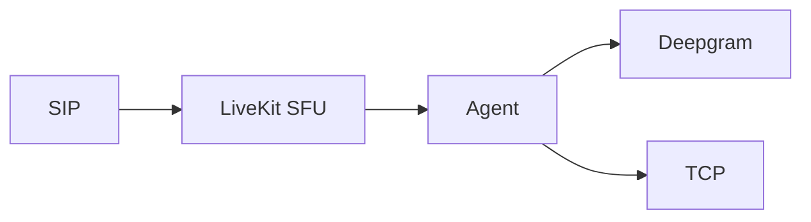
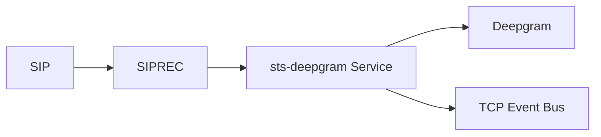
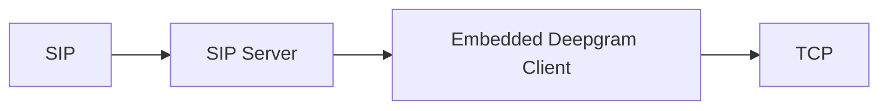

# **Slide 1 — Goal: A Self-Hosted SIPREC Stack for Smaller Companies**

The plan is to build a **standalone SIPREC-based voice ingestion system** that allows Servisbot to integrate with **smaller companies**—without relying on **Twilio or Audiocodes**.
This gives us a fully self-hosted alternative media pipeline that feeds directly into **TCP**.

### Why This Matters

* Some customers cannot use Twilio or enterprise SBCs
* Many smaller firms only support basic SIP/SIPREC
* Our solution must work with **any SBC or PBX** that can mirror RTP via SIPREC
* A fully self-hosted SIPREC pipeline gives Servisbot total independence

### Advantages of a Standalone SIPREC Stack

* **Vendor independence** (no Twilio/Audiocodes for dev or prod)
* **Lower cost**, easier onboarding for smaller clients
* **Predictable, controllable audio pipeline**
* **Deploy anywhere**: on-prem, private VPC, or cloud
* **Direct ingestion into TCP** without LiveKit or WebRTC
* **Supports compliance**, because SIPREC provides dual-stream (A/B sides)
* Builds **Servisbot’s internal telephony expertise** rather than depending on 3rd parties

```mermaid
flowchart LR
    SIPGW[SIP PBX / SBC (Any Vendor)] --> SIPREC
    SIPREC --> STS[Standalone SIPREC → Deepgram Pipeline]
    STS --> TCP[TCP / Servisbot Voice Fabric]
```

---

# **Slide 2 — Why I Moved Away From LiveKit SFU for Transcription**

Originally, I used:

* SIP → LiveKit SFU
* LiveKit → WebRTC Agent
* Agent → Deepgram STT
* Agent → TCP event forwarding

This worked, but had drawbacks:

* Required a full WebRTC agent just for transcription
* Relied on LiveKit SFU for media relay even when not needed
* Extra hops increased latency and complexity
* More components = more failure points



---

# **Slide 3 — The Breakthrough: SIPREC Interception + sts-deepgram**

I realised LiveKit wasn’t necessary for pure transcription.

### New Approach

* Intercept SIPREC events directly from the SIP server
* Extract the RTP media stream **before LiveKit**
* Feed media into the **sts-deepgram** microservice
* sts-deepgram streams audio to Deepgram
* Sends transcription + call events straight to **TCP**
* Eliminates agents, LiveKit SFU, and WebRTC complexity



### Benefits

* Lower latency
* Far simpler architecture
* Total control of SIP/media handling
* No LiveKit dependency for transcription-only use cases

---

# **Slide 4 — The Next Step: Deepgram *Inside* the SIP Server**

We are now exploring integrating Deepgram directly into the SIP gateway (Kamailio / RTPengine path).

### Concept

* SIP -> RTPengine -> **in-process Deepgram client**
* No microservice hop
* Direct streaming from RTP pipeline to Deepgram WebSocket
* Native event emission to TCP



### Expected Gains

* **Ultra-low latency** (no extra containers)
* **Predictable media flow**
* Easier debugging & tracing
* Fully autonomous SIP-based transcription stack

---

# **Slide 5 — Strategic Advantages for Servisbot**

### 1. **Moving off Audiocodes + Twilio (Dev & Prod)**

* No reliance on proprietary SBCs or Twilio programmable voice
* Full control over call handling and media
* Massive cost reduction
* No platform lock-in
* Ideal for enterprise on-prem + private cloud deployments

### 2. **Building Audio & Telephony Expertise In-House**

* We now own SIP, RTP, SIPREC, STT, and media routing
* Internal knowledge → faster debugging, fewer vendor delays
* Allows building bespoke pipelines optimised for voice AI

### 3. **Simpler, Faster Architecture**

* Remove LiveKit SFU for transcription-only scenarios
* Remove WebRTC agents
* SIP server becomes the “source of truth” for call events + media

### 4. **Better Performance & Reliability**

* Shorter audio path → better STT accuracy
* Lower latency → more responsive agents
* Fewer hops → fewer failure modes

