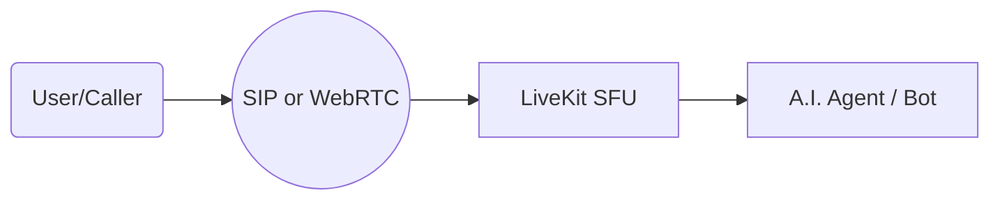
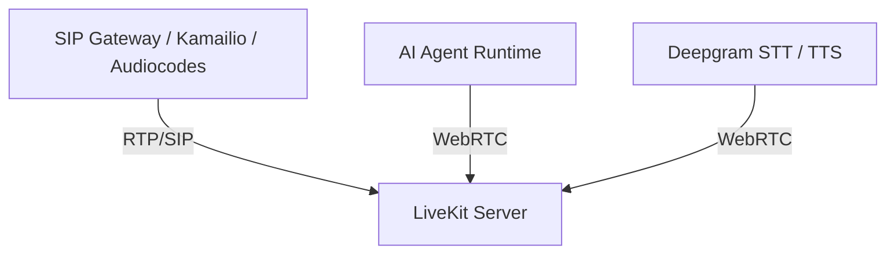
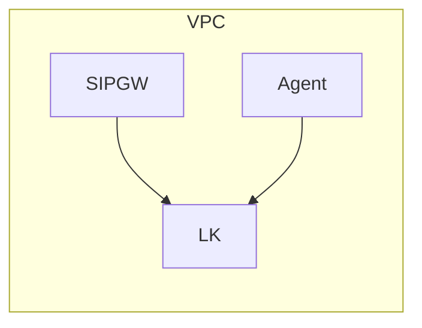
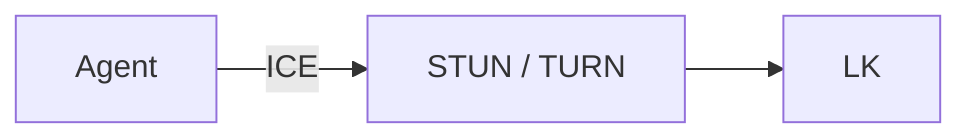
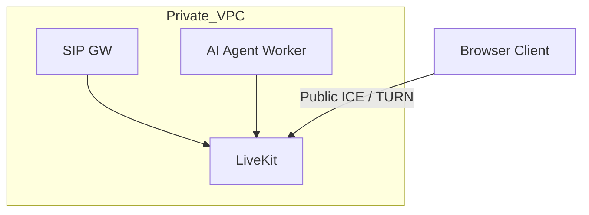

# **Slide 1 — What Is LiveKit?**

LiveKit is a real-time audio/video and data platform designed for low-latency communications.
It provides the backbone for voice AI systems, agent assistants, call flows, and SIP-to-WebRTC bridging.

### Key Features

* Ultra-low latency audio/video
* Reliable SFU architecture
* SDKs for browser, mobile, server, and SIP
* Scales horizontally
* Tooling for recordings, webhooks, and observability

**Diagram**

**Speaker Notes**

* LiveKit is the real-time layer of our voice AI stack.
* It replaces traditional telephony media servers with a scalable, modern SFU.

---

# **Slide 2 — High-Level Architecture**

### Components

* **SIP Gateway**: Bridges PSTN/SIP → WebRTC
* **LiveKit Server**: Handles media, SFU, tracks, rooms
* **AI Agents**: Connect via WebRTC data/audio
* **STT/TTS services**: Consume/produce streams

**Speaker Notes**

* The SIP gateway and the agent both connect to LiveKit as WebRTC peers.
* LiveKit is the central hub of all media routing.

---

# **Slide 3 — Your Implementation Requirements**

### Private VPC Networking

To avoid broken audio paths and NAT issues, both must communicate **inside private subnet ranges**:

* SIP gateway ↔ LiveKit must use **RFC1918 VPC internal IPs** (10.x / 172.16 / 192.168).
* Agents (your Deepgram-based workers) should also connect over **VPC Peering / Internal NLB** rather than public internet.

### Benefits

* Predictable routing
* Lower latency
* No NAT traversal surprises
* Consistent security posture

**Speaker Notes**

* NAT between SIP and LiveKit often breaks RTP candidates.
* Internal routing ensures ICE candidate negotiation always succeeds.

---

# **Slide 4 — STUN / TURN Considerations**

### When Do You Need STUN/TURN?

* **If any component is behind NAT without direct private connectivity** → STUN/TURN required.
* In your deployment:

  * SIP gateway and LiveKit **should NOT need TURN** if fully internal.
  * Browser debugging or agents running outside the VPC may require TURN.

### Options

* **STUN**: Helps discover public IP. Lightweight, minimal.
* **TURN (coturn)**: Full media relay when NAT blocks P2P. Most reliable fallback.

**Speaker Notes**

* TURN adds 2× bandwidth cost, so avoid it on the SIP side.
* But run a TURN server in case any agent instance lives on the public internet or behind carrier-grade NAT.

---

# **Slide 5 — Recommended Deployment Pattern**

### What You Should Do

* Deploy LiveKit in a **private subnet** with an **internal NLB**.
* Deploy SIP gateway (Kamailio, RTPengine, Audiocodes) in the **same VPC or peered VPC**.
* Allow only **internal ICE candidates** (`10.x`, `172.16.x`, `192.168.x`).
* Agents connect through:

  * Private NLB if in VPC
  * TURN if remote

**Reference Diagram**

**Speaker Notes**

* This configuration produces consistent media paths and eliminates the "one-way audio" issues caused by unpredictable NAT traversal.
* The SIP trunk <→ SIP gateway stays pure SIP/RTP; WebRTC is isolated inside the LiveKit room.

---

If you want, I can generate:

✅ A version of this as a **PPTX**, **PDF**, or **Google Slides export**
✅ A **Deep-Dive Architecture Deck (15 slides)** for internal engineering
✅ A **diagram of your exact LiveKit + SIPREC + Deepgram topology**

Just tell me what format you want next.
