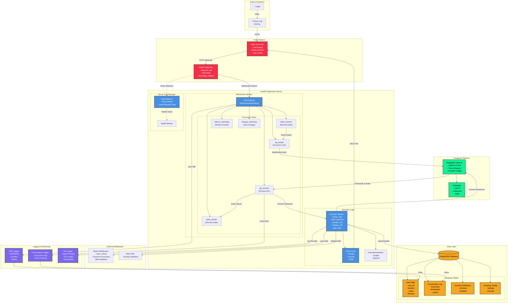
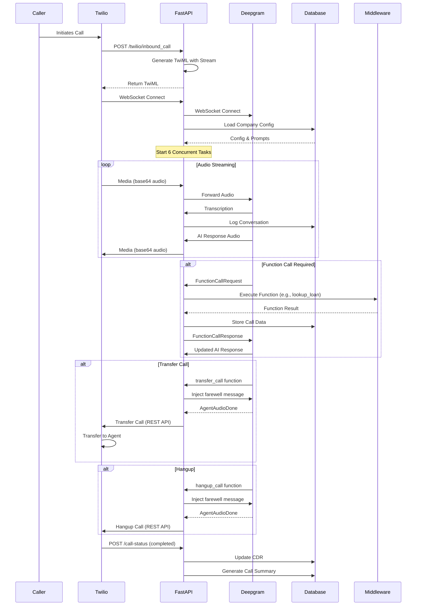
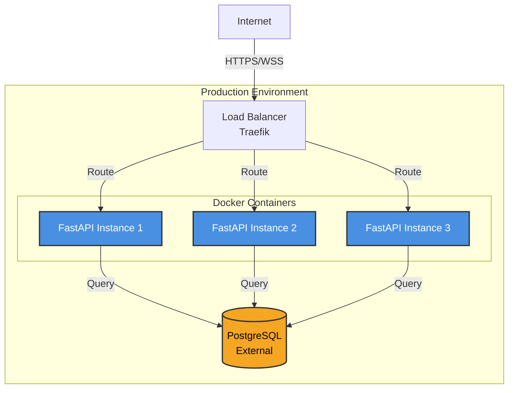

# Twilio + Deepgram Architecture Diagram

## System Architecture

## Detailed Data Flow

## Component Responsibilities

### 1. Twilio Platform
- **PSTN Connectivity**: Routes phone calls from traditional phone networks
- **Media Streams**: Provides real-time audio streaming via WebSocket
- **Call Control**: REST API for hangup, transfer, DTMF operations
- **Webhooks**: Status updates, recording callbacks

### 2. FastAPI Application Server

#### WebSocket Handler
- **Concurrent Task Management**: Runs 6 async tasks simultaneously
  - `twilio_receiver`: Decodes incoming audio from Twilio
  - `twilio_sender`: Encodes and sends audio back to Twilio
  - `dg_sender`: Forwards audio to Deepgram
  - `dg_receiver`: Processes Deepgram responses
  - `silence_watchdog`: Monitors for silence (25s timeout)
  - `hangup_watchdog`: Auto-hangup after extended silence (60s)

#### Business Logic
- **Function Handler**: Executes business functions called by AI
- **Call Control**: Manages call operations (hangup, transfer, DTMF)
- **i18n Support**: Multi-language prompts and responses

#### Server Pool Manager
- **Load Balancing**: Distributes calls across stream servers
- **Health Monitoring**: Tracks server availability and performance

### 3. Deepgram Platform
- **Speech Recognition**: Real-time transcription of caller speech
- **Voice AI**: Generates contextual responses
- **Function Calling**: Requests business logic execution
- **Text-to-Speech**: Converts AI responses to natural speech

### 4. PostgreSQL Database

#### Tables
- **CDR (Call Detail Records)**: Call metadata, duration, status
- **Conversation Log**: Full transcripts and event history
- **Function Definitions**: Business function schemas
- **Company Config**: Per-company settings and prompts

### 5. External Middleware
- **Repay Middleware**: Loan lookups, payment processing
- **Bank APIs**: ABA routing number validation

### 6. Logging System
- **Conversation Logger**: Structured event logging
- **CDR Logger**: Call metrics and analytics
- **File Logger**: Audit trail for prompts and configurations

## Key Features

### Real-Time Processing
- Bidirectional audio streaming with minimal latency
- Concurrent task execution for optimal performance
- Async/await pattern for non-blocking operations

### Intelligent Call Handling
- Silence detection with proactive prompts
- Automatic hangup after extended inactivity
- Context-aware AI responses

### Business Integration
- Dynamic function calling based on conversation
- Secure middleware integration
- Database-backed configuration

### Monitoring & Analytics
- Comprehensive conversation logging
- Call detail records for analytics
- Audit trails for compliance

### Scalability
- Server pool management for load distribution
- Stateless design for horizontal scaling
- Health monitoring and failover

## Audio Flow Details

### Twilio → Deepgram
1. Twilio sends mulaw audio (8kHz, base64-encoded)
2. FastAPI decodes and buffers audio chunks
3. Audio forwarded to Deepgram via WebSocket
4. Deepgram transcribes in real-time

### Deepgram → Twilio
1. Deepgram generates AI response
2. Deepgram synthesizes speech (mulaw format)
3. FastAPI receives binary audio
4. Audio base64-encoded and sent to Twilio
5. Twilio plays audio to caller

## Security Considerations

- **API Authentication**: Deepgram API keys, Twilio auth tokens
- **Request Validation**: Twilio webhook signature verification
- **Sensitive Data**: SSN, loan numbers handled securely
- **Environment Variables**: Credentials stored in env vars
- **Secure WebSockets**: WSS protocol for encrypted communication

## Deployment Architecture

## Technology Stack Summary

| Component | Technology |
|-----------|------------|
| **Backend Framework** | FastAPI (Python) |
| **Telephony** | Twilio Voice API |
| **AI/Speech** | Deepgram Voice AI |
| **Database** | PostgreSQL |
| **WebSocket** | Native Python websockets |
| **Load Balancer** | Traefik |
| **Deployment** | Docker + Docker Compose |
| **Middleware** | Repay API |
| **i18n** | Custom JSON-based system |

## Performance Characteristics

- **Latency**: 100-500ms total (network + processing)
- **Audio Quality**: 8kHz telephony (Twilio) → Deepgram processing
- **Concurrent Calls**: Scales horizontally with server pool
- **Silence Detection**: 25 seconds before prompt
- **Auto Hangup**: 60 seconds of total silence
- **Audio Chunk Size**: ~20ms per chunk

## Related Documentation

- [Twilio + Deepgram Stack Overview](twilio-deepgram-stack.md)
- Technical Design Document (sts-twilio/docs/technical_design.md)
- WebSocket Flow Documentation (sts-twilio/docs/websocket_endpoint_flow.md)
- API Reference (sts-twilio/docs/API_REFERENCE.md)
